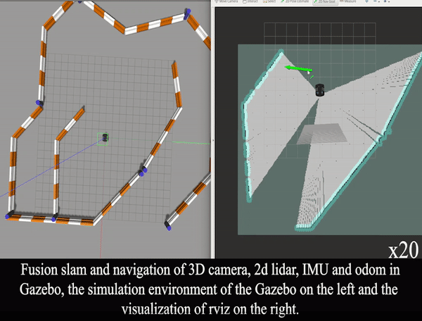
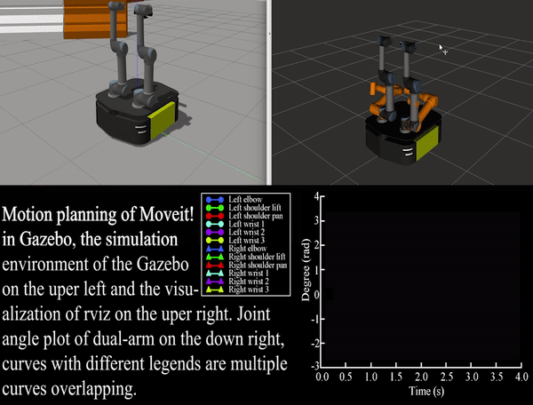

# Overview


[//]: # ()

This repository is about the BetaGo robot maintained by South China University of Technology [PEMT Laboratory](http://www.scut.edu.cn/pemt/).






### Topics
```
/bluetooth_teleop/joy
/camera/accel/imu_info
/camera/gyro/imu_info
/camera/imu
/camera/infra1/camera_info
/camera/infra1/image_rect_raw
/camera/infra2/camera_info
/camera/infra2/image_rect_raw
/camera/motion_module/parameter_descriptions
/camera/motion_module/parameter_updates
/camera/realsense2_camera_manager/bond
/camera/rgb_camera/parameter_descriptions
/camera/rgb_camera/parameter_updates
/camera/stereo_module/auto_exposure_roi/parameter_descriptions
/camera/stereo_module/auto_exposure_roi/parameter_updates
/camera/stereo_module/parameter_descriptions
/camera/stereo_module/parameter_updates
/cmd_lights
/cmd_vel
/diagnostics
/diagnostics_agg
/diagnostics_toplevel_state
/feedback
/imu/data
/imu/data_raw
/imu/mag
/imu_filter/parameter_descriptions
/imu_filter/parameter_updates
/joint_states
/mcu/cmd_fans
/mcu/cmd_lights
/mcu/status
/odometry/filtered
/ridgeback_velocity_controller/cmd_vel
/ridgeback_velocity_controller/odom
/rosout
/rosout_agg
/set_pose
/status
/tf
/tf_static
/twist_marker_server/feedback
/twist_marker_server/update
/twist_marker_server/update_full
/wifi_connected
```

## Dependencies
- ros related
    ```
     sudo apt-get install ros-kinetic-joint-state-publisher-gui
    ```
- gazebo7 >= 7.4.0

    check version by `gazebo --version`.

    follow [here](http://gazebosim.org/tutorials?cat=install&tut=install_ubuntu&ver=7.0#Alternativeinstallation:step-by-step) to update to newest gazebo7 version.
        Problem after update:
            1. `fatal error: ignition/math/Inertial.hh: No such file or directory`. fix: `sudo apt-get install libignition-math2-dev`
            
- realsense2 SDK and Realsense ROS

    SDK installation refer to this [doc](./betago_calibration/doc/rs_d435i_calibration.md), ros package installation refer to [here](https://github.com/IntelRealSense/realsense-ros)
    
- moveit-ros packages:
    ```
    sudo apt-get install ros-kinetic-moveit-ros-*
    sudo apt-get install ros-kinetic-moveit
    ```
- ridgeback packages:
    ```
    sudo apt-get install ros-kinetic-ridgeback*
    ```
- UR5 packages:
    ```
    sudo apt-get install ros-kinetic-ur-*
    sudo apt-get install ros-kinetic-ur5*
    ```

- [td_ros](https://github.com/TouchDeeper/td_ros):

    we add the td_ros directly by submodule.

- [TdLib](https://github.com/TouchDeeper/TdLib):

    modify all the `TdLib_DIR` in the CMakeLists.txt to your case.

## Usage
create the workspace

`mkdir ~/BetaGo_ws && cd ~/BetaGo_ws`

clone this repositories and build

```
git clone --recursive git@github.com:TouchDeeper/BetaGo.git src/
catkin_make
```
Possible problem: 
1. 
 ```
  catkin_package() include dir 'include' does not exist relative to
    '[package_path]'
  ```
   - solution: add `include` directory in the `[package_path]`
2. `No rule to make target '/usr/lib/x86_64-linux-gnu/libproj.so`
    - solution: `sudo ln -s  /usr/lib/x86_64-linux-gnu/libproj.so.9 /usr/lib/x86_64-linux-gnu/libproj.so`
### Simulation
- ur5 and allegro_hand are imported by environment variable RIDGEBACK_URDF_EXTRAS. RIDGEBACK_URDF_EXTRAS = your workspace path/src/betago_description/urdf/betago/ridgeback_urdf_extras.xacro
     - method1: set temporary environment variable:`export RIDGEBACK_URDF_EXTRAS=~/BetaGo_ws/src/betago_description/urdf/betago/ridgeback_urdf_extras.xacro`
    - method2: set permanent environment variable:
        1. terminal:`sudo gedit ~/.bashrc`
        2. add `export RIDGEBACK_URDF_EXTRAS=~/BetaGo_ws/src/betago_description/urdf/betago/ridgeback_urdf_extras.xacro` in the end.
        3. terminal:`source ~/.bashrc`
        
- Check if the model has been downloaded in `~/.Gazebo/`, if not, you need to download the model first and put it in `~/.Gazebo/`. [Download link](https://bitbucket.org/osrf/gazebo_models/downloads/).
For Chinese, download from [rosclub.cn](http://www.rosclub.cn/post-37.html) : link: http://pan.baidu.com/s/1pKaeg0F, password:cmxc
    - set GAZEBO_MODEL_PATH:
        1. terminal:`sudo gedit ~/.bashrc`
        2. add `export GAZEBO_MODEL_PATH="/home/wang/.gazebo/models"` in the end.
        3. terminal:`source ~/.bashrc`
### Real robot
#### Step to connect to the ridgeback by wired connection

1. plug in the network cable to ridgeback's router, plug in the network cable to your pc.
2. start the ridgeback, then push the E-STOP to release the lock. 
3. set the wired connection in your desktop, see the [gif](https://github.com/TouchDeeper/BetaGo/blob/ztd/media/set_wire_network.gif).
4. add the config in the below to your ~/.bashrc, and `source ~/.bashrc`. The `192.168.131.1` is keep the same when wired connection, this IP can also be specified by connecting a screen to ridgeback's computer, and type `ifconfig -a`, this IP is in the `br0` item of output information.
    the `192.168.131.100` is also keep the same when wired connection,  this IP can also be specified by typing `ifconfig -a`in your pc and is in the first item of output information.
    ```
    export ROS_MASTER_URI=http://192.168.131.1:11311 #Ethernet
    export ROS_IP=192.168.131.100
    ```
5.add the config `192.168.131.1 CPR-R100-0057`in the below to your /etc/hosts, the location is after the line like 
    ```
    127.0.0.1	localhost
    127.0.1.1	[your-computer-name]
    ```
6.`rostopic list` in your desktop to see if the topics in the ridgeback have been send to your desktop. If receive the topic, the connection is valid.
7. note that the wired connection will not bread the connection to the wifi, but ssh to ridgeback's computer by wireless IP will be broken.
#### Step to connect to the ridgeback by wireless network
1. connect the ridgeback's computer and your pc to the same Local Area Network.
2. get the IP of ridgeback by `ifconfig -a` in ridgeback's computer. The IP is in the `wlp3s0` item, and the sentence is `inet addr:[IP_ridgeback]`. 
3. get the IP of your pc by 'ifconfig -a' in you pc. The IP is in the `wlo1` item, and the sentence is `inet addr:[IP_pc]`. 
4. comment out the config code for wire connection. And add the config in the below to your ~/.bashrc, and `source ~/.bashrc`
   ```
   export ROS_MASTER_URI=http://[IP_ridgeback]:11311 #Ethernet
   export ROS_IP=[IP_pc]
   ```
5. add the config `[IP_ridgeback] CPR-R100-0057`in the below to your /etc/hosts, the location is after the line like 
   ```
   127.0.0.1	localhost
   127.0.1.1	[your-computer-name]
   ```
6.`rostopic list` in your desktop to see if the topics in the ridgeback have been send to your desktop. If receive the topic, the connection is valid.
7. note!!!: after connection with ridgeback's computer, if your pc also need to run ros, comment out the content added in step 4 and 5 and re-source.
### step to login the ridgeback's pc by ssh
1. `ssh administrator@[IP_ridgeback]`
2. If you want to open multi-terminal, but don't want to login too much user, you can use tmux to split screen.
    1. ssh to ridgeback's computer.
    2. install tmux by 'sudo apt-get install tmux'
    3. refer to [here](https://www.jianshu.com/p/b67567085856) for tmux's usage.
### Step to run the package
- ur5 and allegro_hand are imported by environment variable RIDGEBACK_URDF_EXTRAS. RIDGEBACK_URDF_EXTRAS = your workspace path/src/betago_description/urdf/betago/ridgeback_urdf_extras.xacro
     - method1: set temporary environment variable:`export RIDGEBACK_URDF_EXTRAS=your workspace path/src/betago_description/urdf/betago/ridgeback_urdf_extras.xacro`
    - method2: set permanent environment variable:
        1. terminal:`sudo gedit ~/.bashrc`
        2. add `export RIDGEBACK_URDF_EXTRAS="your workspace path/src/betago_description/urdf/betago/ridgeback_urdf_extras.xacro"` in the end.
        3. terminal:`source ~/.bashrc`
   
## File explanation
None
## Notes
None

## 4. Citation
If you use this package for your research, a footnote with the link to this repository is appreciated: `github.com/TouchDeeper/BetaGo`, or for citation with BibTeX:
```
@misc{ztd2021BetaGo,
  title={BetaGo: a dual_arm moblie robot simulation platform with multiple-sensor based on ROS.},
  author={Tingda Zhuang},
  howpublished={\url{https://github.com/TouchDeeper/BetaGo}},
  year={2021}
}
```
