# Manipulation Package for BetaGo 
This is manipulation packages for BetaGo.
## Usage
### Only Moveit!
```asm
roslaunch betago_moveit_config demo.launch
```
The node graph:


### Moveit! with Gazebo
```asm
roslaunch betago_bringup betago_bringup_moveit.launch
roslaunch betago_moveit_config moveit_rviz.launch
```
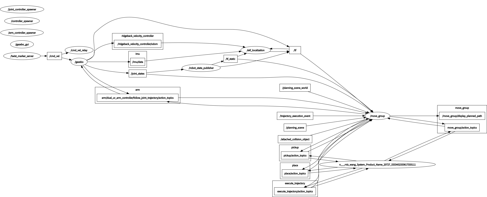

The difference is `Only Moveit!` will create a fake joint state controller and a joint_state_publisher to publish /joint_states while in "Moveit + Gazebo", the real jointStateController will publish the /joint_states. 

args of `betago_bringup_moveit.launch`:
- `dual_arm:=(default:true/false)` : single-arm controller or dual-arm controller

## Step to construct the package for moveit+gazebo
1. use moveit setup_assistant to construct the initial package.
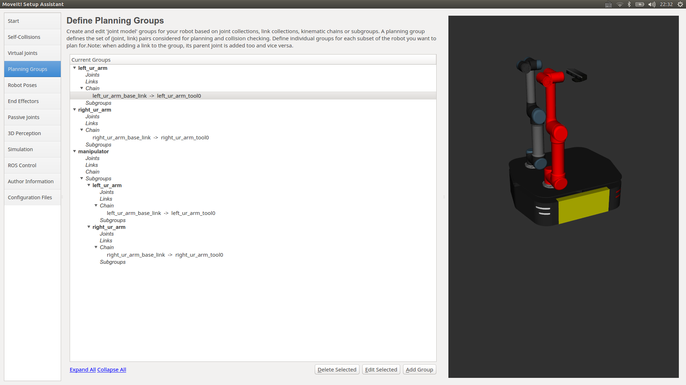
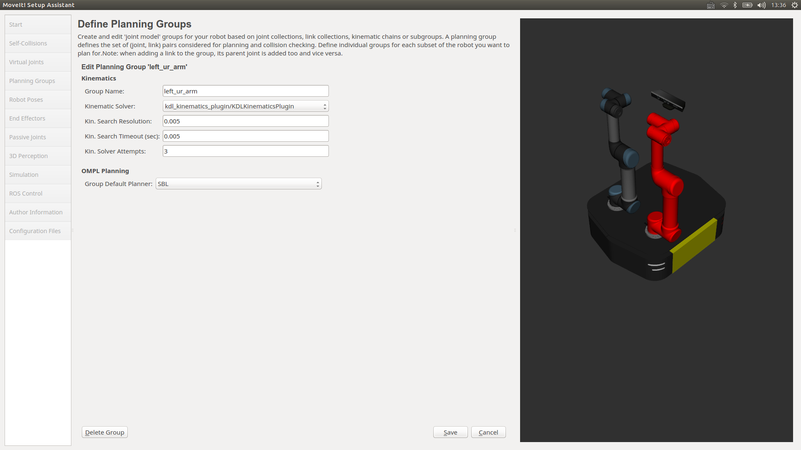
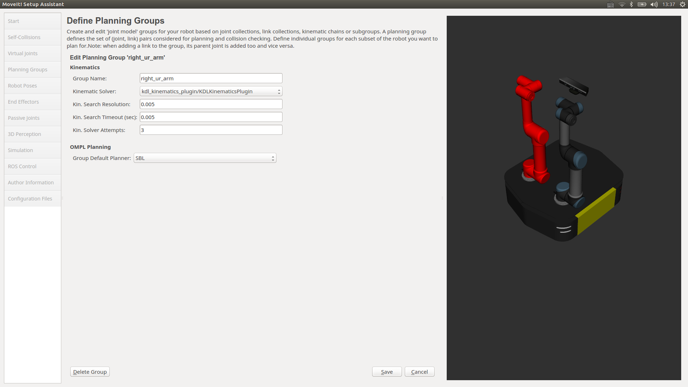
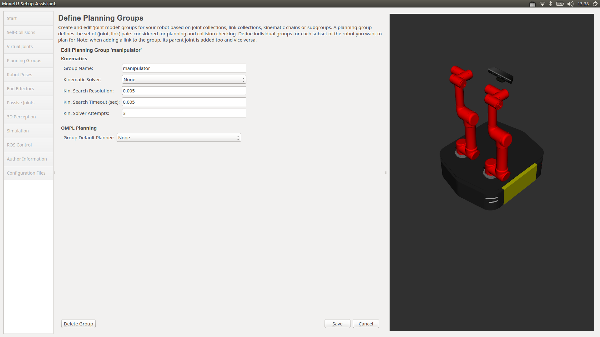

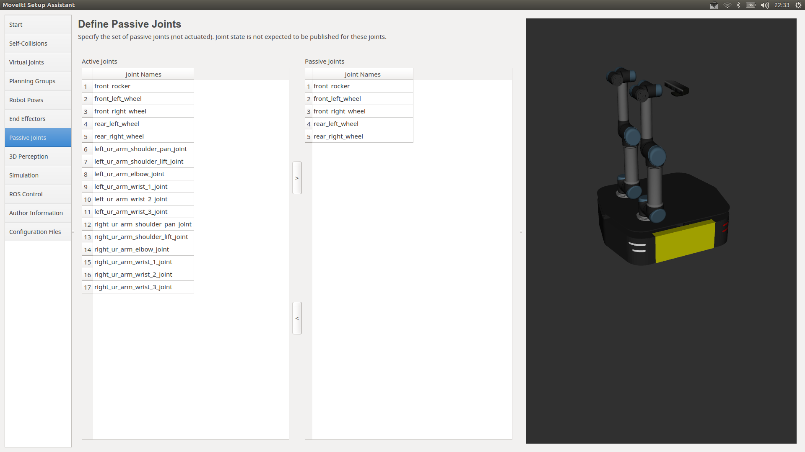
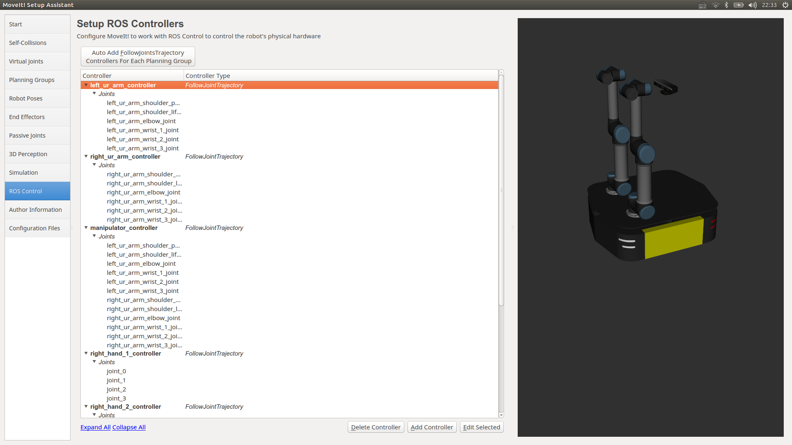

2. create `ridgeback_world.launch`

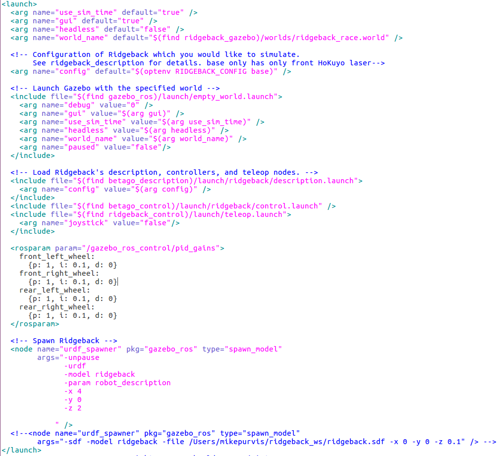

this launch file is mainly used to find `empty.launch`,load `robot_description` and call `urdf_spawner`

3. create `betago_states_gazebo.launch`

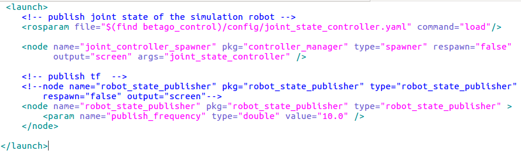

this launch file is mainly used to load `joint_state_controller.yaml`,call `joint_controller_spawner` to start joint_state_controller and call `robot_state_publisher` to publish tf.

4. `joint_state_controller.yaml`

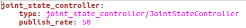

This controller is used to monitor the state of the robot and set the publish rate to 50.

5. create `arm_trajectory_controller.launch`

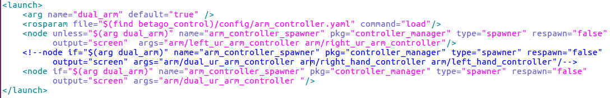

this launch is mainly used to load `arm_controller.yaml` and call `arm_controller_spawner` to start `JointTrajectoryController`

6. `arm_controller.yaml`

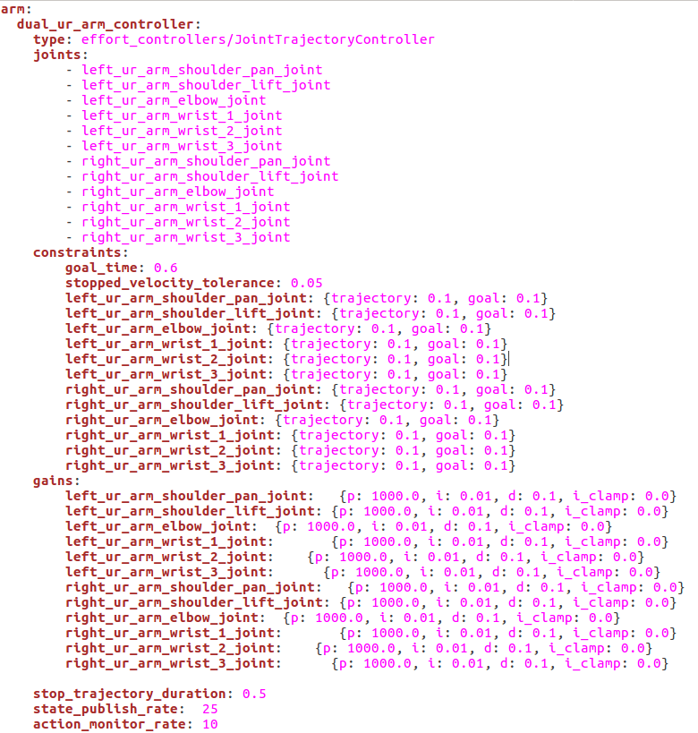
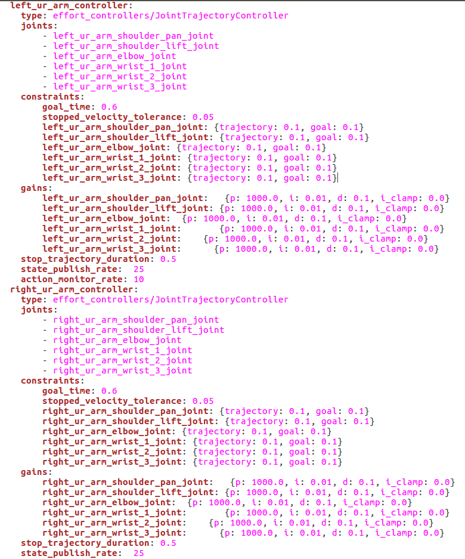

set the controller name: `dual_ur_arm_controller`,`left_ur_arm_controller` and `right_ur_arm_controller`, type: `effort_controllers/JointTrajectoryController` 

set the joint list, constraints and pid gains.


7. copy the `betago_moveit_planning_executation.launch` to betago_moveit_config/launch and change the content to suit your model.
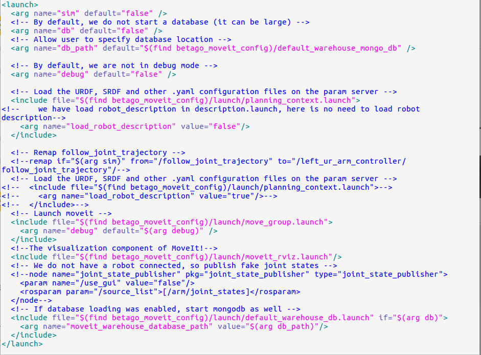

This launch file is mainly used to start `move_group.launch` ,`moveit_rivz.launch`.

move_group.launch can start `node move_group` and `trajectory_execution.launch`which is used to find `ridgeback_moveit_controller_manager.launch.xml`.

8. copy the content in the launch/ridgeback_moveit_controller_manager.launch.xml to the same file in your package.
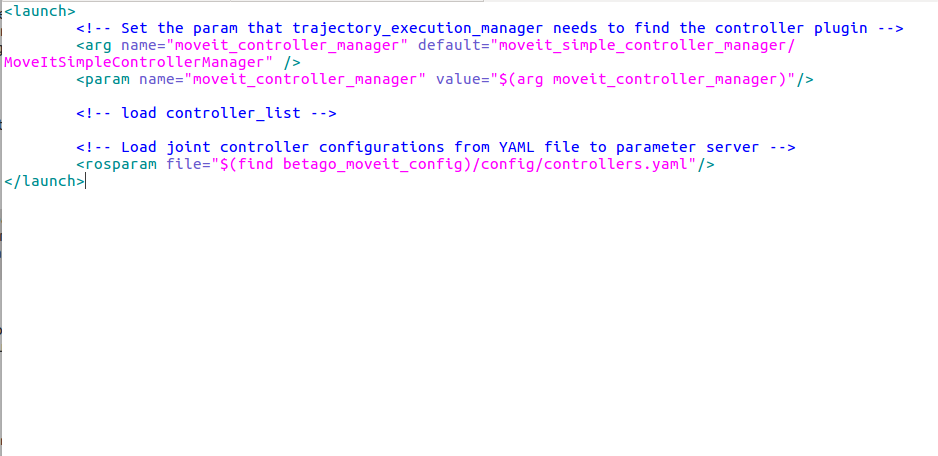

This launch file is mainly used to find `controllers.yaml`

9. copy the controllers.yaml to betago_moveit_config/config and change the content to suit your model.
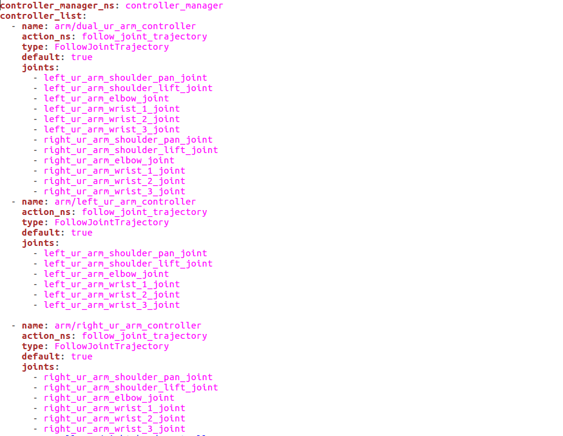

In `name` tag, enter the controller you set in `arm_controller.yaml`.
  
`action_ns` and `type` tag are mainly used to start `follow joint trajectory`，which is used to connect gazebo and rivz.

10. create `betago_bringup_moveit.launch`
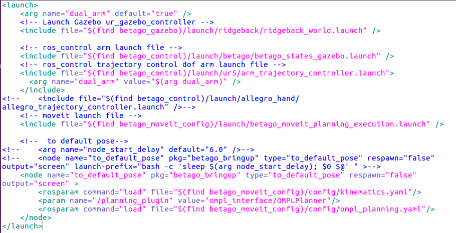

this launch file is mainly used to find `ridgeback_world.launch`, `betago_states_gazebo.launch`, `arm_trajectory_controller.launch` and `betago_moveit_planning_executation.launch`.


11. everytime you run setup assistant to modify the model config, some files don't need to be overwritten.
    
    - confg :
        
        - controller.yaml: this is used to replace the ros_controller.yaml, everytime you add or delete the joint need to be drive, add or delete the corresponding config in the controller.yaml.
        - ompl_planning.yaml: this is used to set planner.
        
    - launch:
        - moveit.rviz
        - moveit_rviz.launch generally dose not need to be overwritten.
        - ridgeback_moveit_controller_manager.launch.xml
        - demo.launch generally dose not need to be overwritten.

## File explanation
None
## Notes
None
## Modify on other project used in BetaGo
None
