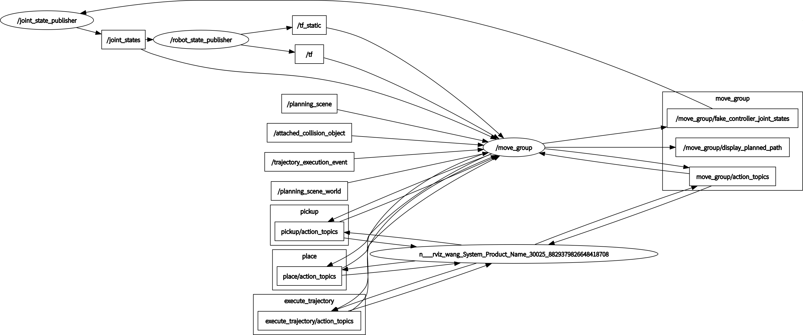

# Manipulation Package for BetaGo 
This is manipulation packages for BetaGo.
## Usage
### Only Moveit!
```asm
roslaunch betago_moveit_config demo.launch
```
The node graph:


### Moveit! with Gazebo
```asm
roslaunch betago_bringup betago_bringup_moveit.launch
roslaunch betago_moveit_config moveit_rviz.launch
```


The difference is `Only Moveit!` will create a fake joint state controller and a joint_state_publisher to publish /joint_states while in "Moveit + Gazebo", the real jointStateController will publish the /joint_states. 
args of `betago_bringup_moveit.launch`:
- `dual_arm:=(default:true/false)` : single-arm controller or dual-arm controller
## Step to construct the package for moveit+gazebo
1. use moveit setup_assistant to construct the initial package.


2. copy the betago_moveit_planning_executation.launch to betago_moveit_config/launch and change the content to suit your model.
3. copy the controllers.yaml to betago_moveit_config/config and change the content to suit your model.
4. copy the content in the launch/ridgeback_moveit_controller_manager.launch.xml to the same file in your package.


## File explanation
None
## Notes
None
## Modify on other project used in BetaGo
None