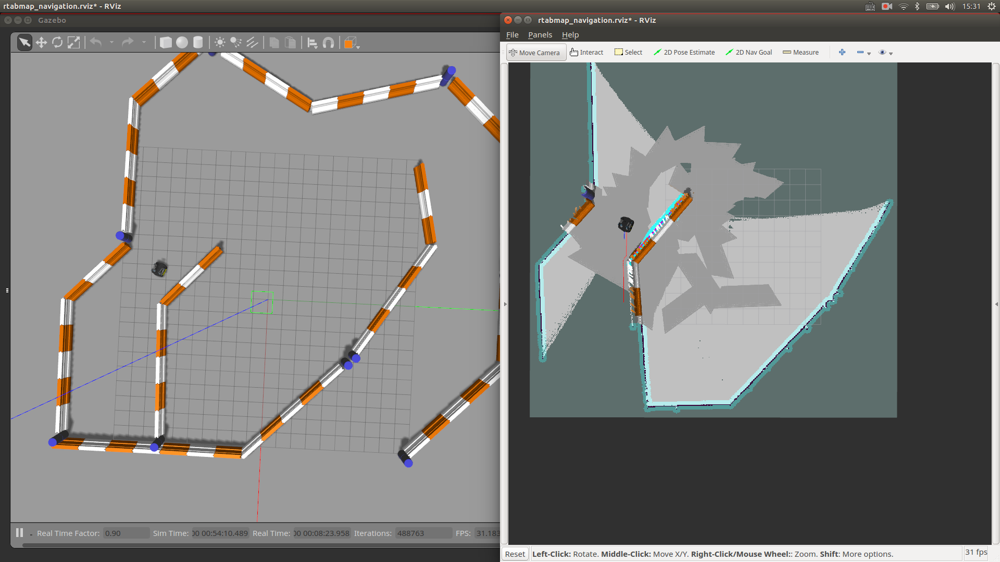

# Navigation Package for BetaGo 
This is navigation package for BetaGo.
## Simulation
### Gmapping
- read the navigation [tutorial](http://www.clearpathrobotics.com/assets/guides/ridgeback/navigation.html) of the ridgeback
- change `roslaunch ridgeback_gazebo ridgeback_world.launch` to `roslaunch betago_bringup betago_bringup_moveit.launch`
- The rest is the same as the tutorial said.
### rtabmap
- only kinect
```asm
 roslaunch betago_navigation navigation_world.launch
 roslaunch betago_navigation rtabmap_sim_only_kinect.launch simulation:=true
 roslaunch betago_navigation rtabmap_rviz.launch
```
- kinect + odom
```asm
 roslaunch betago_navigation navigation_world.launch
 roslaunch betago_navigation rtabmap_sim_kinect_odom.launch simulation:=true
 roslaunch betago_navigation rtabmap_rviz.launch
```
- kinect + lidar + odom
```asm
 roslaunch betago_navigation navigation_world.launch
 roslaunch betago_navigation rtabmap_sim_kinect_scan_odom.launch simulation:=true
 roslaunch betago_navigation rtabmap_rviz.launch
```


## File explanation
None
## Notes
None

## Modify on other project used in BetaGo
None
